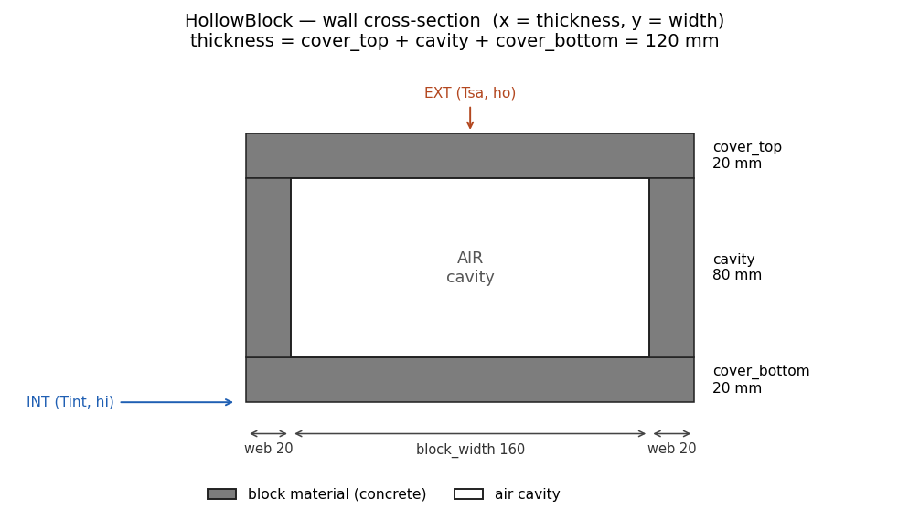
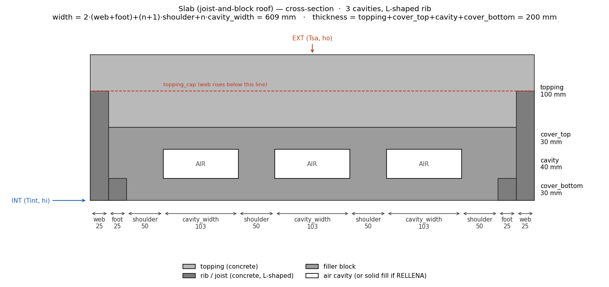

Real masonry units are not homogeneous across their width: a concrete hollow block has
air cavities between webs, and a joist-and-block (*vigueta y bovedilla*) roof alternates
concrete ribs, filler blocks and cavities. Averaging their properties into an equivalent
homogeneous layer misses the physics that matters — heat bridging through the solid webs
and the convective/radiative exchange inside the cavities. For these systems EnerHabitat
solves the heat transfer on a **2D cross-section** of the unit [@barrios2016].

## Domain and assumptions

Constructive units repeat periodically along the wall or roof, so the domain is a single
**repeating cell** — the block (or the rib-to-rib module) cut across its width and
thickness. The lateral cuts are placed on **mirror-symmetry planes** of the periodic
pattern (mid-web, mid-rib), where the temperature field has zero normal gradient — so
the sides of the cell are **adiabatic**. (Periodicity alone would only impose equality
of temperature and flux between opposite sides, not zero flux; it is the mirror
symmetry of the chosen cell that makes the adiabatic condition exact.)

Axis convention (used by the package and throughout these pages): $x$ runs across the
**width** of the cell and $y$ through the **thickness**, from the outside ($y = 0$) to
the inside ($y = e$), as in the cross-section figures below — i.e. the 1D model's
coordinate $x$ (through the thickness) corresponds to $y$ here. Note that the reference
paper [@barrios2016] uses the transposed convention ($x$ through the thickness).

The cell is a stack in $y$ — exterior finishes, the non-homogeneous unit, interior
finishes — where the unit itself is a 2D patchwork of materials and, possibly, cavities.

The model keeps every [1D assumption](model-1d.qmd#domain-and-assumptions) — constant
properties per material, perfect thermal contact, fixed film coefficients, sun–air
forcing, lumped indoor air or fixed setpoint — except that conduction is now
two-dimensional in the cross-section. In addition it assumes:

- the cross-section is **invariant out of plane**: all quantities are per unit length
  along the wall/roof;
- the lateral sides of the cell are mirror-symmetry planes (adiabatic, as above);
- the air of each cavity (`Fill.AIR`) is **well mixed** — one temperature $T_h$ per
  cavity — and radiatively non-participating;
- one **uniform** convective coefficient $h_c$ per cavity, evaluated from the mean
  temperatures of the faces across the thickness (not from each local wall
  temperature);
- the cavity surfaces are grey and diffuse, each emitting at its **mean** temperature.

The canonical list of assumptions, with the consequence each one has for
interpreting the results, is in [Assumptions and limits](assumptions.qmd).

## Governing equations

Conduction in the solids obeys the two-dimensional extension of the
[1D heat equation](model-1d.qmd#eq-heat), with position-dependent properties:

$$
\rho\, c\, \frac{\partial T}{\partial t}
\;=\;
\frac{\partial}{\partial x}\!\left( k\, \frac{\partial T}{\partial x} \right)
+
\frac{\partial}{\partial y}\!\left( k\, \frac{\partial T}{\partial y} \right),
$$ {#eq-heat2d}

where $k(x,y)$, $\rho(x,y)$ and $c(x,y)$ take the value of the material occupying each
point (rib, filler block, topping, solid fill…). Continuity of temperature and flux at
material joints is as in the 1D case.

## Boundary conditions

The boundary conditions close the problem:

$$
\begin{aligned}
y = 0:&\quad h_o \left( T_{sa} - T \right) = -k\, \frac{\partial T}{\partial y}
  && \text{(outdoor, sun–air temperature)}\\[4pt]
y = e:&\quad -k\, \frac{\partial T}{\partial y} = h_i \left( T - T_i \right)
  && \text{(indoor air)}\\[4pt]
x = 0,\ x = W:&\quad \frac{\partial T}{\partial x} = 0
  && \text{(adiabatic sides, periodicity)}
\end{aligned}
$$ {#eq-bc2d}

$T_{sa}$, $h_o$ and $h_i$ are exactly those of the [1D model](model-1d.qmd) — same
average day, same `Tsa()`.

## Solution modes

The indoor air $T_i$ follows the same
[two solution modes as the 1D model](model-1d.qmd#boundary-conditions-and-solution-modes),
with two 2D-specific details:

- In the **free-running** mode the lumped indoor-air node is fed by the
  **width-averaged** convective flux from the indoor surface at $y = e$ (so the energy
  balance is per unit of indoor surface area, as in 1D).
- In the **air-conditioned** mode only the *indoor* node is fixed at the setpoint
  ($T_i = T_n$, or `System2D.setpoint`); the air of each cavity $T_h$ **keeps
  floating**, governed by @eq-cavity-air throughout the AC solve.

## Cavity physics

When the unit's cavity contains air (`Fill.AIR`), three heat-transfer mechanisms act
together [@barrios2016]: conduction through the surrounding solids, **natural
convection** of the cavity air, and **radiation** between the cavity surfaces. (The
alternative, a solid-filled cavity, is described [below](#solid-fill).)

### The cavity-air node

The air inside each cavity is modelled as a single lumped node at temperature $T_h$,
exchanging heat by convection with the four cavity walls:

$$
\rho_a\, c_a\, A_{cav}\, \frac{dT_h}{dt}
\;=\;
\oint_{\partial cav} h_c \left( T_w(s) - T_h \right) ds,
$$ {#eq-cavity-air}

where $A_{cav} = w \cdot d$ is the cavity cross-section (width × depth), the integral
runs along the cavity perimeter with $T_w(s)$ the local wall temperature, and all
quantities are per unit length in the out-of-plane direction. In the discrete form the
perimeter element $ds$ becomes the face length ($\Delta x$ or $\Delta y$) of each wall
node. The convective coefficient $h_c$ depends on the cavity orientation.

### Convective coefficient: walls vs roofs

For a **wall** (`tilt = 90`, vertical cavity) EnerHabitat uses the turbulent
correlation of Xamán et al. [-@xaman2005] for tall cavities of façade elements —
their Eq. (11), aspect ratio 20, $10^4 \le Ra_L \le 10^8$:
$Nu = 0.0857\,Ra_L^{0.3033}$. Substituting $Ra_L = g\beta\Delta T d^3/(\nu\alpha)$
and $Nu = h_c d / k_{air}$, with the air properties anchored at 300 K (see the roof
correlation below), gives the dimensional form actually evaluated, as a function of
the temperature difference between the two faces across the thickness and the cavity
depth $d$ (m):

$$
h_c \;=\; C_w\, \frac{\left| T_{out} - T_{in} \right|^{0.3033}}{d^{\,0.0901}},
\qquad
C_w = 0.0857\, k_{air} \left( \frac{g\,\beta}{\nu\,\alpha} \right)^{0.3033}
\approx 0.59,
$$ {#eq-nu-wall}

where the exponent of $d$ follows from the reduction ($3 \times 0.3033 - 1 =
-0.0901$) and $C_w$ is computed at run time from the same property set as the roof
correlation (so it stays consistent if the air density or heat capacity are
changed). Two provenance notes: the 2016 tool hardcoded $C_w = 0.4005$ — an
unrecorded reduction, ~0.61× the value above — which is kept only in the C-fidelity
regression tests; and Xamán's fits cover **tall** cavities ($A = 20$–$80$), while
the hollow-block cavity has a much lower aspect ratio, so this use is an
**extrapolation**. Both the constant and the extrapolation are tested directly by
the hollow-block hot-box experiment of Borbón et al. [-@borbon2010] in the
validation campaign; the sensitivity of the documented wall's daily energies to
$C_w$ is ~1 % (0.4005 → 0.59).

For a **roof** (`tilt = 0`, horizontal cavity) the regime is Rayleigh–Bénard. If the
lower face is not hotter than the upper one the air stratifies stably and only conducts,
$h_c = k_{air}/d$. Otherwise convection sets in, described by the correlation of
Hollands et al. [-@hollands1975] for horizontal layers heated from below:

$$
h_c \;=\; \frac{k_{air}}{d}
\left(
1 + 1.44 \left[ 1 - \frac{1708}{Ra} \right]^{+}
  + \left[ \left( \frac{Ra}{5830} \right)^{1/3} - 1 \right]^{+}
\right),
\qquad
Ra = \frac{g\, \beta\, \Delta T\, d^3}{\nu\, \alpha},
$$ {#eq-nu-roof}

where $[\,\cdot\,]^{+}$ keeps the positive part and the air properties are anchored at
a fixed reference temperature of 300 K [@incropera2007]: $k_{air} = 0.0262$ W/(m·K),
$\beta = 1/300$ K⁻¹, and $\mu(300\,\mathrm{K}) = 1.846\times10^{-5}$ Pa·s from
Sutherland's law. The kinematic values entering $Ra$ are computed with the
**configurable** air density and heat capacity — $\nu = \mu/\rho_a \approx
1.56\times10^{-5}$ m²/s and $\alpha = k_{air}/(\rho_a c_a) \approx
2.21\times10^{-5}$ m²/s with the defaults — so they remain thermodynamically
consistent if the user changes the air properties. Because $h_c$ depends on the wall
temperatures, it is re-evaluated inside the iteration of every time step (see the
[numerical method](numerics.qmd#solution-algorithm)).

### Radiation between cavity surfaces

The four cavity walls exchange long-wave radiation. The air is non-participating, the
surfaces are grey and diffuse with uniform emissivity $\varepsilon$ (the `emissivity`
parameter, 0.9 by default), and each surface emits at its mean temperature
[@incropera2007]. Because grey surfaces reflect, the exchange couples all four
surfaces through multiple reflections; the enclosure is solved exactly with the
**radiosity system** in Gebhart form [@gebhart1961; @incropera2007]. For the four
isothermal surfaces the solution reduces to a pairwise expression with constant
**transfer factors** $\mathfrak{F}_{mn}$:

$$
q_{m \to n} \;=\; \mathfrak{F}_{mn}\, \sigma \left( T_m^4 - T_n^4 \right),
\qquad
\mathfrak{F} \;=\; \varepsilon^2 \left[ I - (1-\varepsilon)\, F \right]^{-1} F,
$$ {#eq-rad}

with $\sigma$ the Stefan–Boltzmann constant and $F$ the view-factor matrix. The
$\mathfrak{F}_{mn}$ inherit reciprocity ($A_m \mathfrak{F}_{mn} = A_n
\mathfrak{F}_{nm}$), satisfy the closure $\sum_n \mathfrak{F}_{mn} = \varepsilon$, and
reduce to $F_{mn}$ for black surfaces ($\varepsilon = 1$). Since the geometry and
$\varepsilon$ are constant, the $4\times4$ system is solved **once** per cavity
geometry; per-surface emissivities are supported by the same formulation. (The
legacy Ener-Habitat tool used the direct-exchange approximation
$q = \varepsilon \sigma F_{mn} \Delta T^4$, which overestimates the dominant pair —
e.g. by ~10 % at $\varepsilon = 0.9$ in the parallel-plate limit, where the exact
factor is $1/(2/\varepsilon - 1)$.)

For a rectangular cavity of width $w$ and depth $d$ the view factors follow from the
crossed-strings method; e.g. between the top wall and one lateral wall, and between
the two opposite walls:

$$
F_{u \to r} = \tfrac{1}{2}\left( 1 + \tfrac{d}{w} - \sqrt{1 + \tfrac{d^2}{w^2}} \right),
\qquad
F_{u \to d} = 1 - 2 F_{u \to r}.
$$ {#eq-vf}

### Solid fill (`Fill.SOLID`) {#solid-fill}

The cavity can instead be filled with a solid material (e.g. an insulating core): the
cavity physics switches off and the fill behaves as one more conducting material in
@eq-heat2d. Filling with the *same* material as the shell makes the unit homogeneous —
in that limit the 2D solution reduces to the 1D one, which is one of the package's
validation checks (see [Validation](numerics.qmd#validation)).

## Geometries

### Hollow-block wall — `HollowBlock`

A shell of a single material with one cavity per cell; walls only (`tilt = 90`). The
repeating cell takes half a web on each side, so the full web between two cavities is
`2·web`.

{#fig-hollow}

- cell width $W = 2 \cdot \texttt{web} + \texttt{block\_width}$
- thickness $e = \texttt{cover\_top} + \texttt{cavity} + \texttt{cover\_bottom}$

### Joist-and-block roof — `Slab`

Roofs only (`tilt = 0`). Three solid materials — the compression topping, an L-shaped
concrete rib (web + foot) at each edge of the cell, and the filler block — plus $n$
equal cavities, each one with its own lumped air node (@eq-cavity-air) and its own
$h_c$.

{#fig-slab}

- cell width $W = 2(\texttt{web} + \texttt{foot}) + (n+1)\cdot\texttt{shoulder} + n\cdot\texttt{cavity\_width}$
- thickness $e = \texttt{topping} + \texttt{cover\_top} + \texttt{cavity} + \texttt{cover\_bottom}$

The rib's web rises through the whole section except the top `topping_cap` of the
topping, reproducing the real joist profile.

## The average day

The climate forcing — the synthetic average day and `Tsa()` — is exactly the 1D one:
see [The average day](model-1d.qmd#the-average-day).

## Constraints

- The `layers` list of a `System2D` contains **exactly one** 2D element (`HollowBlock`
  or `Slab`); any other entries are ordinary homogeneous layers (finishes), handled as
  1D bands of the cross-section. At most **7 layers** including the element.
- The element's thickness is derived from its `geometry`, so it is not repeated as a
  layer thickness.
- Orientation is validated: `HollowBlock` requires `tilt = 90`, `Slab` requires
  `tilt = 0`.

## Outputs and units

All energies are expressed **per unit of indoor surface area** (built from the
width-averaged flux at $y = e$), so 1D and 2D results are directly comparable.

| Result | Mode | Meaning | Units |
|---|---|---|---|
| `Ti` (`pandas.Series`) | both | Indoor air temperature over the converged day | °C |
| `energy_transfer` | `solve()` | Energy delivered to the indoor air | J/(m²·day) |
| `Qout` | `solve()` | Gross energy leaving the indoor air (≈ `energy_transfer` in the periodic regime) | J/(m²·day) |
| `cooling_energy` | `solveAC()` | Cooling demand to hold the setpoint | J/(m²·day) |
| `heating_energy` | `solveAC()` | Heating demand to hold the setpoint | J/(m²·day) |
| `solve_dataframe` | both | `Ti`, `Tso`, `Tsi`, `Thueco` on the `Tsa()` time grid | °C |
| `Tfield` | both | Temperature field `(nx, ny)` at the end of the last day | °C |

The convergence diagnostics (`days`, `day_error`, `converged`, `inner_iterations`,
`energy_imbalance`) and the sampling conventions are described in the
[API reference](api.qmd#system2d).

## References

::: {#refs}
:::
